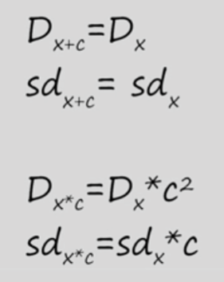

# Блок №1 Введение:
- рек-я книг: [Статистика и котики](https://www.litres.ru/book/vladimir-savelev-10569666/statistika-i-kotiki-22471090/)

## Генеральная совокупность и выборка
- генеральная совокупность - множество всех объектов, о которых мы бы хотели делать выводы в рамках работы над проблемой.
- часть генеральной совокупности - репрезентативная выборка
- способы
    - простая случайная выборка
    - стратифицированная выборка
        - сначала разобъем на несколько групп (страт)
        - потом случайно будем выбирать элементы из групп
    - групповая выборка (кластер)
        - разделим на несколько кластеров (в случае если они похожи между собой)
        - берем любой кластер (1 или несколько)
        - из кластера извлекаем элементы

## Типы переменных. Количественные и номинативные переменные
- типы переменных: 
    - количественные
        - непрерывные
        - дискретные
    - качественные (номинативные)
        - за цифрами нет никакого смысла (лейблы)
    - ранговые

## Меры центральной тенденции
- инструмент анализа - гистрограмма частот
- описательные статистики:
    - нероцентральная тенденция - насколько высокие зн-я принимает наблюдение
    - мера изменчивости - диапазон наблюдений
- инструменты:
    - найти моду распр-я (dot plot)
    - найти медиану
    - найти среднее значение (выборочное среднее)
- если выборка имеет перекосы, не симметрична, есть выбросы или имеет несколько мод, то выборочное среднее может "ввести в заблуждение" и лучше использовать моду или медиану.
- свойства среднего:
    

## Меры изменчивости
- размах
- дисперсия - средний квадрат отклонений зн-ий признака от средней величины
    - в знаменателе надо вычитать единицу из кол-ва элементов в выборке
- среднеквадратическое отклонение - квадратный корень из дисперсии
- свойства дисперсии:



## Квартили распределения и график box-plot
- квартили - три точки, которые делят упорядоченное множество на четыре равные части
- box plot график

    - разность между первым и третьим квартилем - межквартильный размах
    - точки за графиком - те значения, которые не уложились в 1.5 межквартильных размаха
    - иногда границы "усов" включают мин и макс

## Нормальное распределение
- свойства:
    - унимодально
    - симметрично
    - отклонения от среднего подчиняются определенному вероятностному закону
    
- стандартизация (z-преобразование) - приведение данных к виду, где среднее равно нулю, а дисперсия - 1.

## Центральная предельная теорема
- cтандартная ошибка среднего - стандартное отклонение признаков в ген совокупонсти деленное на корень квадратный кол-ва элементов
    - если элементов больше 30, то можно брать стандартное отклонение выборки
- цитата:
```
Можно сказать, что ЦПТ - это значительно более сильное по смыслу утверждение:
Пусть есть признак, распределенный КАК  УГОДНО* с некоторым средним и некоторым стандартным отклонением. Тогда, если мы будем выбирать из этой совокупности выборки объема n, то их средние тоже будут распределены нормально со средним равным среднему признака в ГС и отклонением стандартным отклонением, se, формулу которого мы уже приводили в прошлых шагах.
```

## Доверительные интервалы для среднего
- [ссылка](http://tcts.cogitoergo.ru/blog/golova-professora-bambldorfa/) на разбор ДИ


## Идея статистического вывода, p-уровень значимости
- [калькулятор](https://gallery.shinyapps.io/dist_calc/)
- комментарий к видео:

