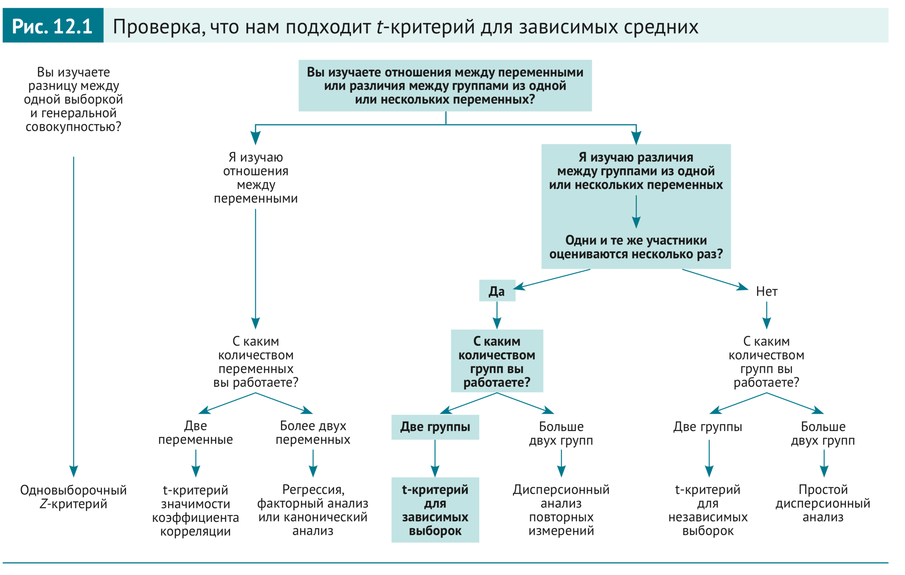
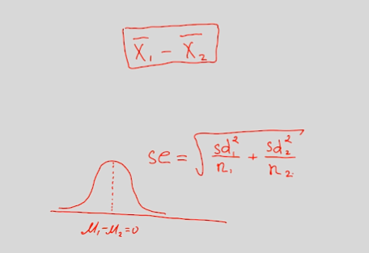
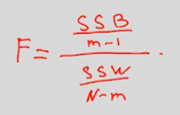
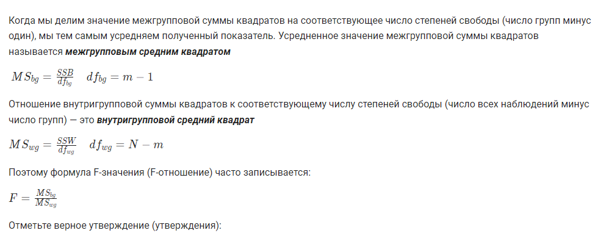

# Блок №2 Введение: Сравнение средних

## T-распределение
- диаграмма из книги "статистика для кто (думает, что) ненавидит статистику"

- если размер выборки меньше 30, то нарушается предположение что все выборочные средние будут вести себя в соответствии с нормальным распределением
- т.о. если число наблюдение невелико и стандартное отколоение в _ГС_ не известно, то используется распределение Стьюдента (t-distribution)
    - имеет более высокие хвосты
    - важный параметр - число степеней свободы (кол-во наблюдений минус 1)
        - чем их больше, тем ближе распр-е к нормальному
        - но отличие "на хвостах" сохраняется
- [статья про степени свободы](https://habr.com/ru/companies/stepic/articles/311354/)

## Сравнение двух средних; t-критерий Стьюдента
- при многократном проведение эксперимента по сравнению средних двух выборок получили бы такой рез-т:

- такое распределение соответствует т-распределению
- требования:
    - дисперсии внутри групп должны быть примерно одинаковы (гомогенность дисперсий)
        - проверка. Критерий Ленна и Критерий Фишера.
    - __если объем выборок небольшой__ (меньше 30), то требует нормальность их распределения
        - если же наблюдений больше 30, то т-тест можем справиться и с такими данными
- [применение т-тест](https://koch-kir.medium.com/%D0%B8%D1%81%D1%82%D0%BE%D1%80%D0%B8%D1%8F-%D0%BE%D0%B4%D0%BD%D0%BE%D0%B3%D0%BE-%D0%BE%D0%B1%D0%BC%D0%B0%D0%BD%D0%B0-%D0%B8%D0%BB%D0%B8-%D1%82%D1%80%D0%B5%D0%B1%D0%BE%D0%B2%D0%B0%D0%BD%D0%B8%D1%8F-%D0%BA-%D1%80%D0%B0%D1%81%D0%BF%D1%80%D0%B5%D0%B4%D0%B5%D0%BB%D0%B5%D0%BD%D0%B8%D1%8E-%D0%B2-%D1%81%D1%82%D0%B0%D1%82%D0%B8%D1%81%D1%82%D0%B8%D1%87%D0%B5%D1%81%D0%BA%D0%B8%D1%85-%D1%82%D0%B5%D1%81%D1%82%D0%B0%D1%85-55139a5558d) к "ненормальным" данным

## Проверка распределения на нормальность, QQ-Plot
- построить гистрограмму частот нашего признака и поверх нее наложить кривую идеального норм распределения

- QQ plot
    - показывает насколько хорошо наши точки согласуюстя с "предсказанными", если бы наше распр-е было нормальным.
        - если точки ползут "вверх", то значит что получаем слишком большие зн-я, чем должы были
        - если точки ползут "вниз" то значит, что получаем слишком маленькие зн-я

## Однофакторный дисперсионный анализ
- Очень часто в экспериментах и исследованиях возникает необходимость сравнить несколько групп между собой. В таком случае мы можем применять однофакторный дисперсионный анализ.  Та переменная, которая будет разделять наших испытуемых или наблюдения на группы (номинативная переменная с нескольким градациями) называется независимой переменной. А та количественная переменная, по степени выраженности которой мы сравниваем группы, называется зависимая переменная. 
- порядок шагов
    - находим общее среднее
    - находим SST (общая сумма квадратов) - отклонение каждого наблюдения от общего среднего в квадрате
        - кол-во степеней свободы = N-1
        - доп варианты
            - сумма квадратов междугрупповая (SSB)
                - отклонение групповых средних от общего среднего умноженное на кол-во элементов
                - кол-во степенй свобод = m-1
            - сумма квадратов внутригрупповая (SSW)
                - сумма отклонений от среднего внутри каждой группы (не путать с общим средним)
                - кол-во степеней свободы = N - m (кол-во наблюдений минус кол-во групп)
    - выводы:
        - если SSB >> SSW то группы значительно различаются
        - если SSB << SSW то группы не различаются
    - F-значение:
        - 
    - при истинности нулевой гипотезы большинство F-значений должны быть маленькими
    - уточнение формул:
        - 

## Множественные сравнения в ANOVA
- множественное тестирование без поправок приводит к потери контроля над уровнем значимости
- есть поправки
    - Бонферони (делить на кол-во попарных сравнений между группами)
        - слишком сильно "режет" мощность
    - критейрий Тьюки
        - _подробностей пока не дали_
    - и другие (самостоятельнй поиск)
    - доп информация - [доклад](https://www.youtube.com/watch?v=4w9t4McuAy8)

## Многофакторный ANOVA
- идея: общая изменчивость складывается из:
    - внутригрупповой изменчивости (ssw)
    - изменчивость первого фактора (ssb_a)
    - изменчивость второго фактора (ssb_b)
    - изменчивость взаимодействий факторов (ssb_a*ssb_b)
- требования к данным:
    - нормальность распределений
    - гомогенность дисперсий
    - при кол-ве наблюдений больше 50 устойвича в отклонениям
- тест Левина на гомогенность

## АБ тесты и статистика
- [Интервью с ДС в ВК](https://www.youtube.com/watch?v=gljfGAkgX_o)
    - замечание про то, что классический бутстэп "долго", но есть Пуассоновский бутстрэп
- доп материалы:
    - Крутая [книга](https://experimentguide.com/) о том, как спланировать и провести своё первое A/B тестирование
    - [Подборка](https://exp-platform.com/) примеров применения A/B тестов в индустрии: как топовая литература на тему, так и интервью от сотрудников крупных компаний, применяющих A/B тесты в работе
    - Пошаговый, написанный с Никитой в соавторстве [гайдлайн](https://medium.com/@vktech/practitioners-guide-to-statistical-tests-ed2d580ef04f?fbclid=IwAR0Q7Gb-YmHG0Cg28IMC6RdBcjwqM466HaB4c-CtpXd03N-XyNzv9N5sWF0) для создания A/B тестов на языке Python:
    - [Статья](https://research.google/pubs/estimating-uncertainty-for-massive-data-streams/), описывающая как определять, комбинировать и объединять метрики (и комбинации из 2-3 метрик) с высокой прогнозирующей способностью таким образом, чтобы уменьшать их число и снижать вариативность
    - [Работа](https://arxiv.org/abs/1404.7530), рассматривающая различные подходы к планированию и созданию рандомизированных экспериментов, чтобы не получить мнимые отличия на этапе дизайна
    - Краткие [конспекты](https://research.fb.com/publications/top-challenges-from-the-first-practical-online-controlled-experiments-summit/) докладов исследователей и практиков из области анализа данных с конференции KDD 2019, где можно почерпнуть новаторские решения в планировании экспериментов для бизнеса
    - Краткое [руководство](https://onlineuserengagement.github.io/) как правильно выстроить работу b2c: на какие метрики необходимо смотреть и как их учитывать для улучшения работы
    - Появилась книга в русскоязычном переводе "ДОВЕРИТЕЛЬНОЕ А/В-ТЕСТИРОВАНИЕ" Авторы: Сюй Я., Тан Д., Кохави Р. https://dmkpress.com/catalog/computer/software_development/978-5-97060-913-2/
