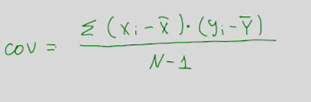
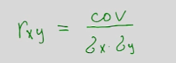
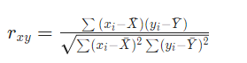
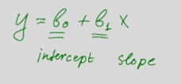
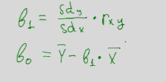
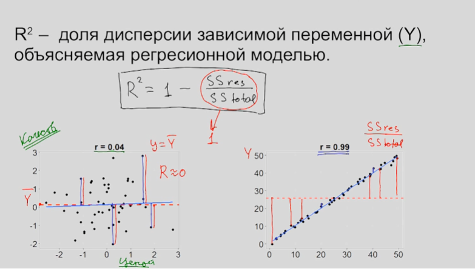
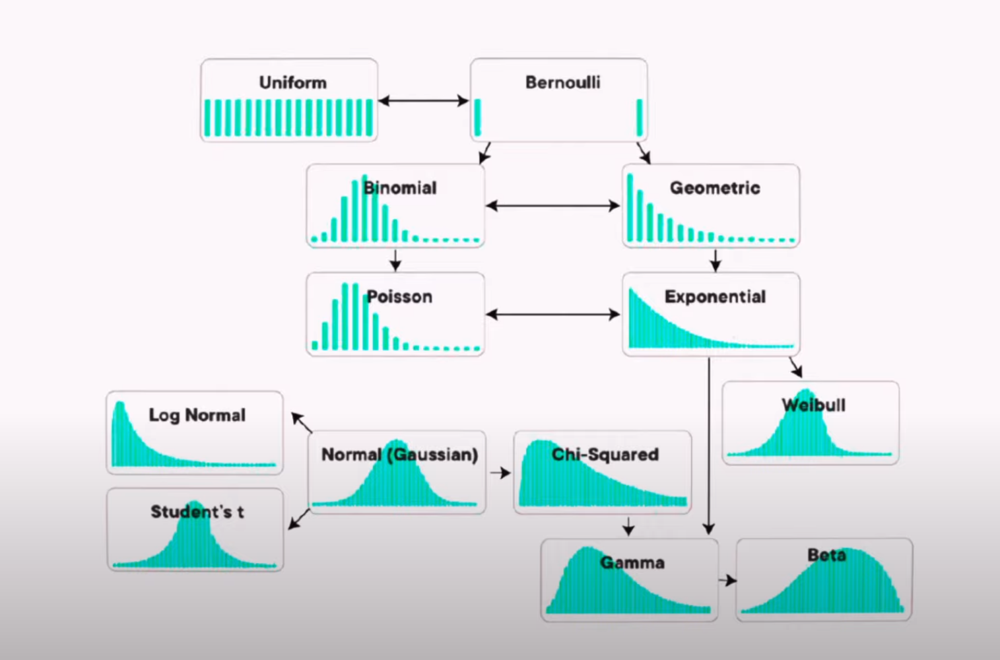
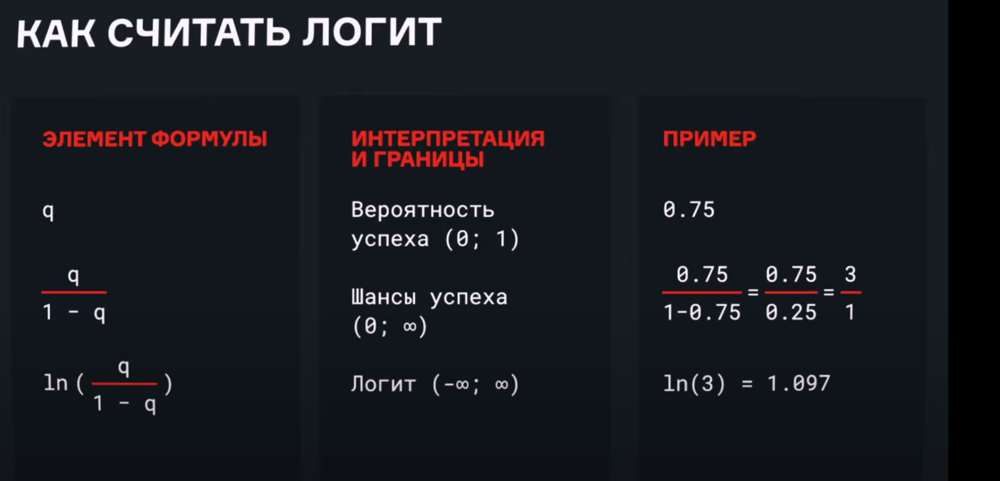
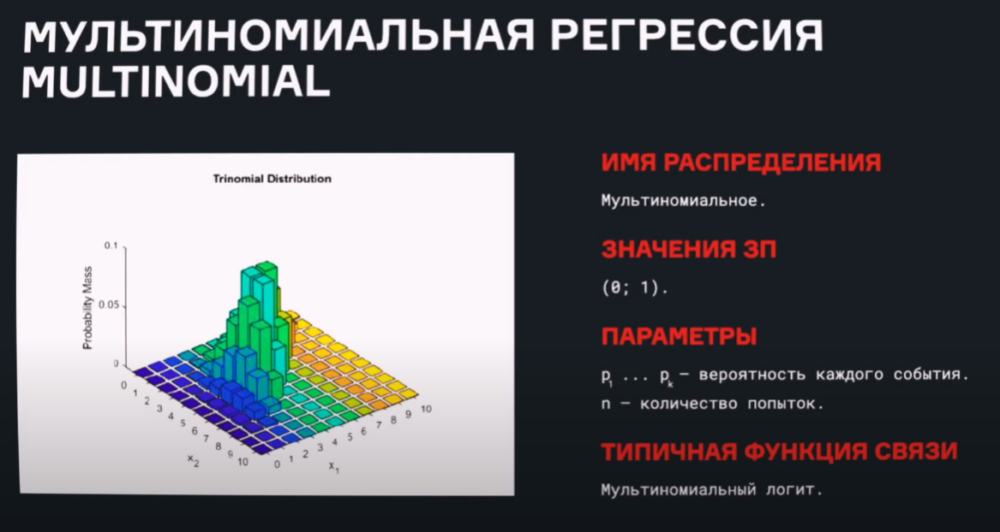

# Блок №3 Корреляция и регрессия

## Понятие корреляции
- график рассеивания
- корреляция

- коэффициент корреляции

    - или
- коэффициент корреляции 

- квадрат коэффициента корреляции - коэффициент детерминации, который показывает в какой степени дисперсия одной переменной обусловлена влиянием другой

## Условия применения коэффициента корреляции

- важность учета наличия "третьей" переменной
- можно применять критерий Пирсона только когда есть линейная зависимость

## Регрессия с одной независимой переменной
- линия регрессии
    - зависимая и не зависимая переменная

- МНК
    - подсчет коэффициентов
    
- где b0 - interscpt, b1 - slope

## Гипотеза о значимости взаимосвязи и коэффициент детерминации

## Условия применения линейной регрессии с одним предиктором
- условия применения:
    - линейная взаимосвязь X и Y
    - нормальное распр-е остатков
    - одинаковая изменчивость зависимой переменной на всех уровнях независимой переменной (постоянная изменчивость остатков)

## Регрессионный анализ с несколькими независимыми переменными
- требования к данным:
    - линейная зависимость переменных
    - нормальное раср-е остатков
    - одинаковая изменчивость зависимой переменной на всех уровнях независимой переменной
    - проверка на мультиколлинеарность
    - норм распр-е

## Выбор наилучшей модели
- нельзя включать переменные, которые коррелируют между собой

## GLM и продвинутые темы
- Виды распределений

- подсчет логит-а

- мультиноминальная регрессия
